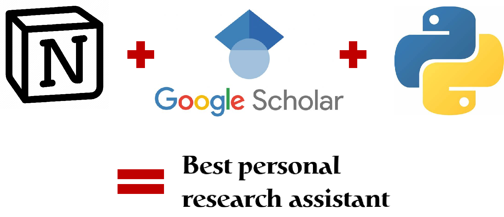

# Notion Citation Updater

The **Notion Citation Updater** is a Python script designed to automate the process of updating citation counts for academic papers stored in a Notion database. By leveraging the power of the Scholarly library, this tool searches for publications by title and retrieves their citation information.

<!-- PROJECT SHIELDS -->

[![Contributors][contributors-shield]][contributors-url]
[![Forks][forks-shield]][forks-url]
[![Stargazers][stars-shield]][stars-url]
[![Issues][issues-shield]][issues-url]

<!-- PROJECT LOGO -->
 

  

  <h3 align="center">"完美的"README模板</h3>
  

    一个"完美的"README模板去快速开始你的项目！
     
    <a href="https://github.com/shaojintian/Best_README_template"><strong>探索本项目的文档 »</strong></a>
     
     
    <a href="https://github.com/shaojintian/Best_README_template">查看Demo</a>
    ·
    <a href="https://github.com/shaojintian/Best_README_template/issues">报告Bug</a>
    ·
    <a href="https://github.com/shaojintian/Best_README_template/issues">提出新特性</a>
  

<!-- links -->
[your-project-path]:Vincia-Jun/Notion-Citation-Updater
[contributors-shield]: https://img.shields.io/github/contributors/Vincia-Jun/Notion-Citation-Updater.svg?style=flat-square
[contributors-url]: https://github.com/Vincia-Jun/Notion-Citation-Updater/graphs/contributors
[forks-shield]: https://img.shields.io/github/forks/Vincia-Jun/Notion-Citation-Updater.svg?style=flat-square
[forks-url]: https://github.com/Vincia-Jun/Notion-Citation-Updater/network/members
[stars-shield]: https://img.shields.io/github/stars/Vincia-Jun/Notion-Citation-Updater.svg?style=flat-square
[stars-url]: https://github.com/Vincia-Jun/Notion-Citation-Updater/stargazers
[issues-shield]: https://img.shields.io/github/issues/Vincia-Jun/Notion-Citation-Updater.svg?style=flat-square
[issues-url]: https://img.shields.io/github/issues/Vincia-Jun/Notion-Citation-Updater.svg
